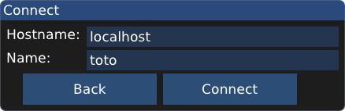

# Pax et Mors
 ## A Quest for Pandalium
Game for GGJ2020

###To install :

#### Required libraries

- GF (https://github.com/GamedevFramework/gf)

- SFML-Audio

#### Download & Build
```
git clone https://github.com/Hatunruna/ggj2020.git
cd ggj2020/
git submodule update --init
mkdir build
cd build
cmake ..
make
make install (May need elevated privileges)
```

###To Run :

One server must be initialize
```
./tmpgame-server
```
To run the game (n times for n players):
```
./tmpgame
```
And connect to the server IP or hostname :


